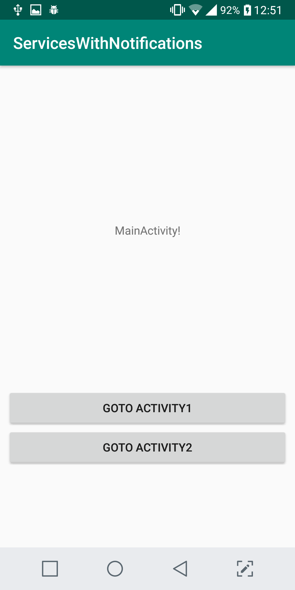
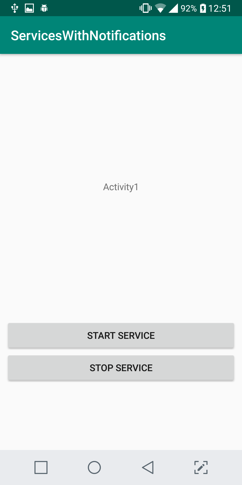
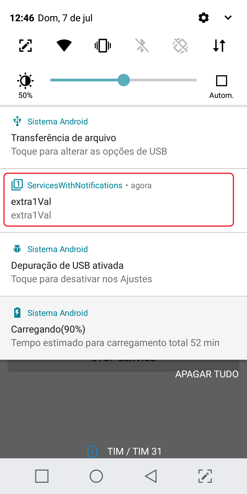
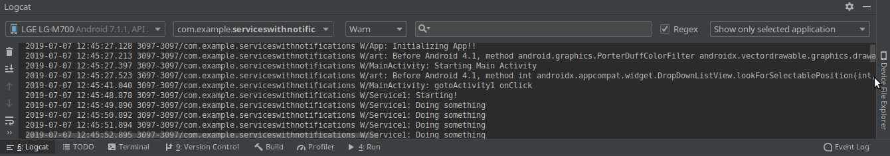

#ServicesWithNotifications

This project is an example of an Native Android App with foreground services and notifications.

The main activity contains two buttons, each one leads to another activity (Activity1 or Activity2). 
Both Activity1 and Activity2 contains two buttons each, "start service" and "stop service". 
Activity1 can start and stop the Service1 and Activity2 do the same for Service2. 
Both services only print logs every 1 second. 
When any of the services is started, a notification is created to indicate to the user that the service is running. In newer versions of Android, this is required to allow the service to remain running.

